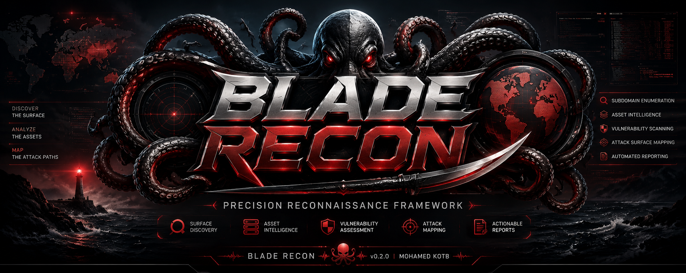
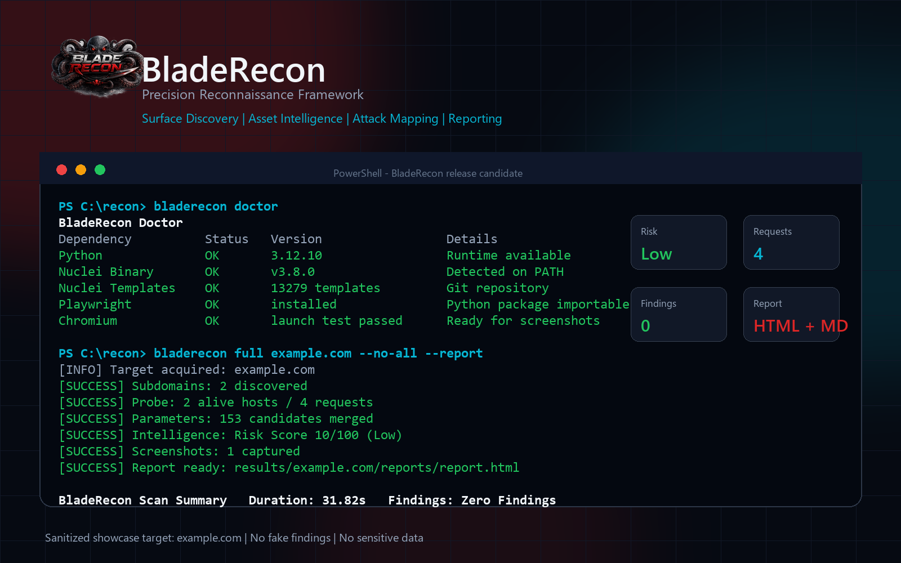
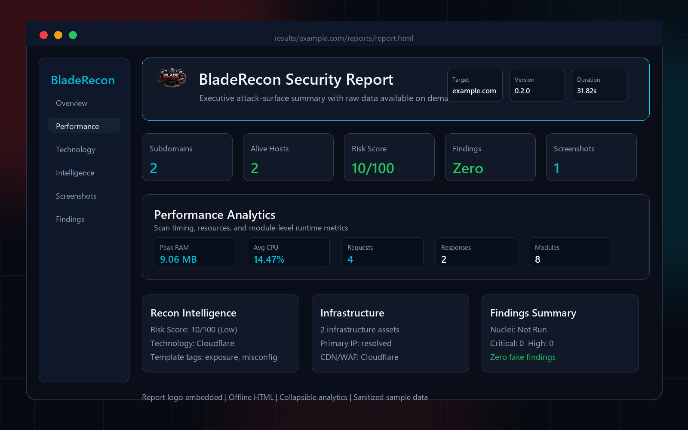

# BladeRecon




BladeRecon is a lightweight reconnaissance framework for bug bounty, web pentesting, and reporting-focused attack-surface discovery. It keeps the workflow terminal-native and modular while producing clean TXT, JSON, JSONL, Markdown, and HTML outputs.

Developer: [Mohamed Kotb](https://github.com/mohamedxk9tb)

## Project Overview

BladeRecon helps you move from a target domain to a readable reconnaissance report:

```text
subdomains -> probe -> js -> endpoints -> secrets -> parameters -> intelligence -> advanced -> screenshots -> nuclei -> report
```

It is designed to be:

- Lightweight and Windows-friendly
- Beginner friendly
- Useful for bug bounty and small pentest workflows
- Easy to inspect manually and automate from files

It is not intended to replace Amass, distributed recon stacks, or enterprise scanners.

## Media Preview

Additional release media is stored in `assets/`:

- `logo.png`: square project mark
- `report-logo.png`: report header/logo source
- `social-preview.png`: repository/social card preview

### CLI Preview



- Dimensions: `1600 x 1000`
- Format: PNG
- Content: BladeRecon banner, realistic scan output, `doctor` output, and a professional dark terminal frame
- Data policy: sanitized `example.com` target, no fake findings, no sensitive data

### Report Preview



- Dimensions: `1600 x 1000`
- Format: PNG
- Content: report logo, Risk Score, Intelligence Summary, Infrastructure, Findings Summary, and expanded Performance Analytics
- Data policy: sanitized sample data with zero fake findings

## Features

| Area | Capability |
| --- | --- |
| Subdomains | Passive sources, source attribution, cache, optional lightweight DNS expansion |
| Probe | Alive hosts, status codes, redirects, titles, content length, server/CDN/WAF hints |
| JavaScript | Finds external JavaScript assets from alive hosts |
| Endpoints | Extracts endpoint candidates from downloaded JavaScript |
| Secrets | Informational secret pattern detection with confidence and risk labels |
| Parameters | Historical URL sources plus local fallback URL inventory and wordlist candidates |
| Screenshots | Optional Playwright screenshots with duplicate/placeholder filtering |
| Intelligence | Technology, infrastructure, cloud asset, risk, and template-selection context |
| Advanced Recon | Historical URLs, historical JS, low-noise content discovery, security-header assets, and asset prioritization |
| Nuclei | Optional Nuclei wrapper with safe, balanced, aggressive, and intelligence-guided profiles |
| Reports | Dark-theme offline HTML and Markdown reports with KPI cards, section search, exports, intelligence summaries, and performance analytics |
| Safety | Safety profiles, request ceilings, per-host concurrency, rate limits, and Nuclei timeout reporting |
| Utilities | Doctor, repair, cache management, resume state, and install helper |

## Supported Modules

| Command | Description | Main Outputs |
| --- | --- | --- |
| `subdomain` | Discover subdomains from multiple sources | `subdomains.txt`, `subdomains.json`, `subdomains.jsonl` |
| `probe` | Probe alive hosts | `alive.txt`, `probe.json`, `probe.jsonl` |
| `js` | Discover JavaScript assets | `js_files.txt`, `js_files.json` |
| `endpoints` | Extract endpoints from JavaScript | `endpoints.txt`, `endpoints.json` |
| `secrets` | Detect exposed JavaScript secret patterns | `secrets.txt`, `secrets.json` |
| `param` | Discover URL parameters | `parameters.txt`, `parameters.json`, `parameters.jsonl` |
| `intelligence` | Generate recon intelligence from existing artifacts | `intelligence/*.json`, `technology/technology.json` |
| `advanced` | Generate advanced recon intelligence from existing artifacts | `historical/`, `historical_js/`, `content_discovery/`, `asset_priority.json` |
| `screenshot` | Capture screenshots from alive hosts | PNG files, `failed_screenshots.txt` |
| `nuclei` | Run Nuclei templates | `results.json`, `results.jsonl`, `results.md` |
| `report` | Generate Markdown and HTML reports | `report.md`, `report.html` |
| `full` | Run the standard workflow | All module outputs |

## Installation

See [INSTALL](INSTALL.md) for complete Windows, Python, Go, Nuclei, Playwright, Docker, and verification instructions.

From source:

```bash
git clone https://github.com/mohamedxk9tb/BladeRecon.git
cd BladeRecon
python -m venv .venv
.venv\Scripts\activate
python -m pip install --upgrade pip
python -m pip install .
bladerecon doctor
```

Optional external tools:

```bash
bladerecon install-deps
python -m playwright install chromium
```

BladeRecon installs Nuclei from the v3 release line when using `install-deps`.

## Quick Examples

```bash
bladerecon --help
bladerecon doctor
bladerecon subdomain hackerone.com
bladerecon probe hackerone.com
bladerecon js hackerone.com
bladerecon endpoints hackerone.com
bladerecon secrets hackerone.com
bladerecon param hackerone.com
bladerecon intelligence hackerone.com
bladerecon advanced hackerone.com --profile safe
bladerecon report hackerone.com
```

Full workflow:

```bash
bladerecon full hackerone.com
bladerecon full hackerone.com --profile safe
bladerecon report hackerone.com
```

Resume and cache:

```bash
bladerecon resume hackerone.com
bladerecon cache info
bladerecon cache clear
```

Docker:

```bash
docker build -t bladerecon .
docker run --rm bladerecon doctor
docker run --rm -v "%cd%\results:/app/results" bladerecon full hackerone.com
```

## Command Reference

| Command | Example | Expected Output |
| --- | --- | --- |
| `subdomain` | `bladerecon subdomain hackerone.com` | `results/hackerone.com/subdomains/` |
| `probe` | `bladerecon probe hackerone.com` | `results/hackerone.com/probe/` |
| `js` | `bladerecon js hackerone.com` | `results/hackerone.com/js/` |
| `endpoints` | `bladerecon endpoints hackerone.com` | `results/hackerone.com/endpoints/` |
| `param` | `bladerecon param hackerone.com` | `results/hackerone.com/parameters/` or skipped state |
| `intelligence` | `bladerecon intelligence hackerone.com` | `results/hackerone.com/intelligence/` and `results/hackerone.com/technology/` |
| `advanced` | `bladerecon advanced hackerone.com --profile safe` | Historical, content-discovery, header-asset, and priority artifacts |
| `secrets` | `bladerecon secrets hackerone.com` | `results/hackerone.com/secrets/` |
| `screenshot` | `bladerecon screenshot hackerone.com` | `results/hackerone.com/screenshots/` or skipped state |
| `nuclei` | `bladerecon nuclei hackerone.com --profile balanced` | `results/hackerone.com/nuclei/` or skipped state |
| `report` | `bladerecon report hackerone.com` | `results/hackerone.com/reports/` |
| `full` | `bladerecon full hackerone.com --profile safe` | Standard workflow outputs with conservative active-request limits |
| `doctor` | `bladerecon doctor` | Runtime dependency table |
| `resume` | `bladerecon resume hackerone.com` | Resumes unfinished full workflow modules |
| `cache info` | `bladerecon cache info` | Cache size, sources, and age |
| `cache clear` | `bladerecon cache clear` | Safe cache cleanup summary |
| `--version` | `bladerecon --version` | Version, build date, Python, platform |
| `install-deps` | `bladerecon install-deps` | External dependency installation helper |

## Doctor Command

Run doctor before the first real scan:

```bash
bladerecon doctor
```

Doctor checks:

- Go availability
- Nuclei availability
- Playwright package
- Chromium browser availability
- Results directory write permission

Optional dependencies can be missing. BladeRecon will skip the related modules and continue the workflow.

## Scan Safety Profiles

BladeRecon defaults to `balanced`. Use `safe` for bug bounty programs or shared infrastructure, and `aggressive` only when you explicitly want higher active-request volume.

| Profile | Intended Use | Active Safeguards |
| --- | --- | --- |
| `safe` | Bug bounty and conservative validation | Low concurrency, low RPS, tighter request ceilings, one request per host for HTTP/browser modules |
| `balanced` | Default day-to-day recon | Moderate concurrency, capped JS/screenshots/Nuclei targets, per-host limits |
| `aggressive` | Explicit opt-in speed | Higher ceilings and concurrency while still retaining rate limits |

Examples:

```bash
bladerecon probe hackerone.com --profile safe
bladerecon js hackerone.com --profile safe
bladerecon screenshot hackerone.com --profile safe
bladerecon nuclei hackerone.com --profile safe
bladerecon full hackerone.com --profile safe
```

The active profile is written to `scan_state.json`, module metadata, and the HTML report.

## Output Structure

```text
results/
`-- example.com/
    |-- scan_state.json
    |-- subdomains/
    |   |-- subdomains.txt
    |   |-- subdomains.json
    |   `-- subdomains.jsonl
    |-- probe/
    |   |-- alive.txt
    |   |-- metadata.json
    |   |-- probe.json
    |   `-- probe.jsonl
    |-- js/
    |   |-- js_files.txt
    |   |-- metadata.json
    |   |-- js_files.json
    |   `-- files/
    |-- endpoints/
    |   |-- endpoints.txt
    |   `-- endpoints.json
    |-- secrets/
    |   |-- secrets.txt
    |   `-- secrets.json
    |-- parameters/
    |   |-- parameters.txt
    |   |-- parameters.json
    |   |-- parameters.jsonl
    |   `-- parameters_from_urls.txt
    |-- technology/
    |   |-- technology.txt
    |   `-- technology.json
    |-- intelligence/
    |   |-- attack_surface.json
    |   |-- cloud_assets.json
    |   |-- historical_dns.json
    |   |-- infrastructure.json
    |   |-- infrastructure_assets.json
    |   |-- risk_score.json
    |   `-- template_intelligence.json
    |-- historical/
    |   |-- urls.txt
    |   |-- urls.json
    |   |-- parameters.txt
    |   |-- endpoints.txt
    |   |-- endpoints.json
    |   `-- metadata.json
    |-- historical_js/
    |   |-- js_urls.txt
    |   |-- js_urls.json
    |   |-- endpoints.txt
    |   |-- endpoints.json
    |   |-- parameters.txt
    |   `-- metadata.json
    |-- content_discovery/
    |   |-- interesting_paths.txt
    |   |-- interesting_paths.json
    |   `-- metadata.json
    |-- historical_diff.json
    |-- security_headers_assets.json
    |-- asset_priority.json
    |-- advanced_metadata.json
    |-- screenshots/
    |-- nuclei/
    |   |-- metadata.json
    |   |-- results.json
    |   |-- results.jsonl
    |   `-- results.md
    |-- reports/
    |   |-- report.html
    |   `-- report.md
    `-- logs/
        |-- scan.log
        |-- errors.log
        `-- scan_meta.json  # duration, performance, request/response counts
```

## Screenshots

Screenshots are optional and require Playwright Chromium:

```bash
python -m playwright install chromium
bladerecon screenshot hackerone.com
```

If Chromium is missing, BladeRecon displays a skip reason and continues.

## Roadmap

- Keep the CLI lightweight and Windows-friendly
- Improve report intelligence without changing output formats unnecessarily
- Keep README and social media assets current for release candidates
- Expand test coverage for real-world edge cases
- Keep optional dependencies graceful and transparent
- Prepare `v0.2.0` for public Release Candidate evaluation

## Documentation

- [INSTALL](INSTALL.md)
- [QUICKSTART](QUICKSTART.md)
- [TROUBLESHOOTING](TROUBLESHOOTING.md)
- [CHANGELOG](CHANGELOG.md)

## License

MIT
